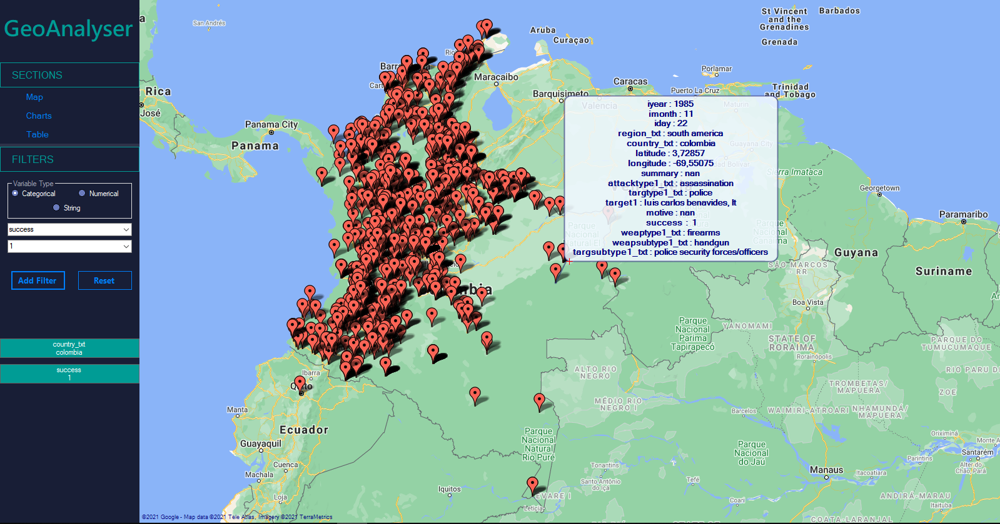

# Visualizing Geolocated Data | C# GMaps WinForm

The current project is intended to visualize a dataset of geolocation data in a 2D map and statistical data via graphs. The dataset used is from the Global Terrorism Database (GTD) involving data about terrorist attacks around the world. 

## Applications

## Documentation

[English](https://docs.google.com/document/d/1CijrqKsIsJqWok7NQQmqc5la85YPflYSwbEwSrXZlh4/edit?usp=sharing)

[Spanish](https://docs.google.com/document/d/1I1HwoAdVSDDUDWaDNESiI2X2GqfMJ9tUmQaw-ev22_M/edit?usp=sharing)

## Presentation

[Video presentation](https://youtu.be/98VelHEbMHY)

## Authors
[Sebastián García Acosta](https://github.com/SebasGarcia08)

[Christian Gallo Peláez](https://github.com/Gallo9923)

[Juan Fernando Angulo Salvador](https://github.com/Juanferas)

